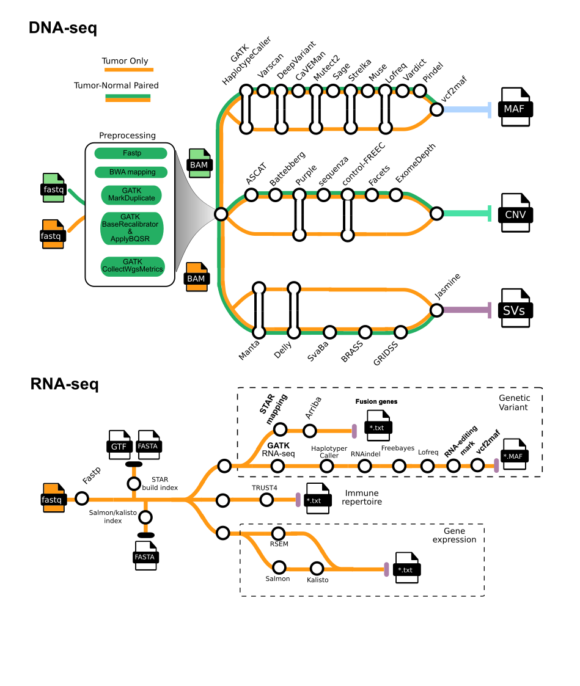

[](https://doi.org/10.5281/zenodo.16892396)
[](https://docs.conda.io/en/latest/)
[](https://www.docker.com/)
[](https://sylabs.io/docs/)


## Introduction
**ClinDet** (**Clin**ical variants **Det**ector)  is a Snakemake pipeline for comprehensive analysis of cancer genomes and transcriptomes, integrating multiple state-of-the-art tools to generate consensus results. The pipeline supports a wide range of experimental setups, including:

1. FASTQ input files

2. Whole genome sequencing (WGS), whole transcriptome sequencing (WTS), and targeted/panel sequencing (WXS)

3. Paired tumor/normal and tumor-only sample configurations

4. Most GRCh37 and GRCh38 reference genome builds

5. Non-human species (e.g., mouse, worm)

## Pipeline overview

<p align="center"></p>

## Installation
To build the complex ClinDet analysis environment, you must first install Conda, Docker, and SingularityCE. Afterwards, please follow the instructions in the [Installation](https://zyllifeworld.github.io/clindet_docs/Quick/install.html) chapter of the ClinDet documentation.

## Usage

> [!NOTE]
> If you are not familiar with snakemake, please refer to [this page](https://snakemake.readthedocs.io/en/stable/)。

All you need to run ClinDet is a samplesheet.csvfile that contains the paths to your input fastq files.

```csv
Tumor_R1_file_path,Tumor_R2_file_path,Normal_R1_file_path,Normal_R2_file_path,Sample_name,Target_file_bed,Project
/AbsoPath/of/projects/CGGA_WES/data/T_CGGA_D14_r1.fq.gz,/AbsoPath/of/projects/CGGA_WES/data/T_CGGA_D14_r2.fq.gz,/AbsoPath/of/projects/CGGA_WES/data/B_CGGA_D14_r1.fq.gz,/AbsoPath/of/projects/CGGA_WES/data/B_CGGA_D14_r2.fq.gz,CGGA_D14,/AbsoPath/of/target.bed,CGGA_WES
/AbsoPath/of/projects/CGGA_WES/data/T_CGGA_653_r1.fq.gz,/AbsoPath/of/projects/CGGA_WES/data/T_CGGA_653_r2.fq.gz,/AbsoPath/of/projects/CGGA_WES/data/B_CGGA_653_r1.fq.gz,/AbsoPath/of/projects/CGGA_WES/data/B_CGGA_653_r2.fq.gz,CGGA_653,/AbsoPath/of/target.bed,CGGA_WES
```

Then, you can Launch `ClinDet` by prepared a *.smk file (e.g. snake_wes.smk).
```bash
nohup snakemake -j 30 --printshellcmds -s snake_wes.smk \
--use-singularity --singularity-args "--bind /your/homepath/:/your/homepath/" \
--latency-wait 300 --use-conda >> wes.log
```

For more details and further functionality, please refer to the main [ClinDet documentation](https://zyllifeworld.github.io/clindet_docs/)


## Use cases
To facilitate user adoption, ClinDet includes a variety of use cases. These examples are designed to help users become proficient with the software and adjust it for their specific analysis. Detailed information is available in the [Use Case](https://zyllifeworld.github.io/clindet_docs/usecase/index.html) chapter of the documentation.


1. **Use case I**: SNV and CNV calling from Whole exome sequencing data
1. **Use case II**: Fusion genes detection from multiple myeloma patient RNA-seq
2. **Use case III**: Whole genome sequencing of COLO829 cell line
3. **Use case IV**: Quantifying​​ the contributions of DNA repair defective gene mutations to mutational signatures（***C. elegans***） 

## ClinDet Development Visualized​
<iframe src="//player.bilibili.com/player.html?bvid=BV1eTsUzuEFo&page=1" scrolling="no" border="0" frameborder="no" framespacing="0" allowfullscreen="true"> </iframe>

## Credits
The `ClinDet` pipeline was written and is maintained by Yuliang Zhang ([@Yuliang Zhang](https://github.com/zyllifeworld)) , Junyi Zhang and Jianfeng Li from
the [National Research Center for Translational Medicine at Shanghai](https://github.com/clindet).

We thank the following organizations and people for their extensive assistance in the development of this pipeline,
listed in alphabetical order:
- [Broad Institute](https://www.broadinstitute.org/)
- [German Cancer Research Center](https://www.dkfz.de/en/)
- [Hartwig Medical Foundation Australia](https://www.hartwigmedicalfoundation.nl/en/partnerships/hartwig-medical-foundation-australia/)
- [Wellcome Sanger Institute](https://www.sanger.ac.uk/)
- [New York Genome Center](https://www.nygenome.org/)
- Jianfeng Li


## Citations

You can cite the `ClinDet` Zenodo record for a specific version using the following DOI:
[10.5281/zenodo.16892396](https://doi.org/10.5281/zenodo.16892396)


> **Sustainable data analysis with Snakemake**
>
> Mölder, F., Jablonski, K.P., Letcher, B., Hall, M.B., Tomkins-Tinch, C.H., Sochat, V., Forster, J., Lee, S., Twardziok, S.O., Kanitz, A., Wilm, A., Holtgrewe, M., Rahmann, S., Nahnsen, S., Köster, J.
>
> _F1000Research_ 2021. doi: [10.12688/f1000research.29032.3](https://doi.org/10.12688/f1000research.29032.3).


## Future Work
1. Advanced downstream analysis based on consensus results (e.g. Driver gene identification)
2. Benchmark report
3. ...