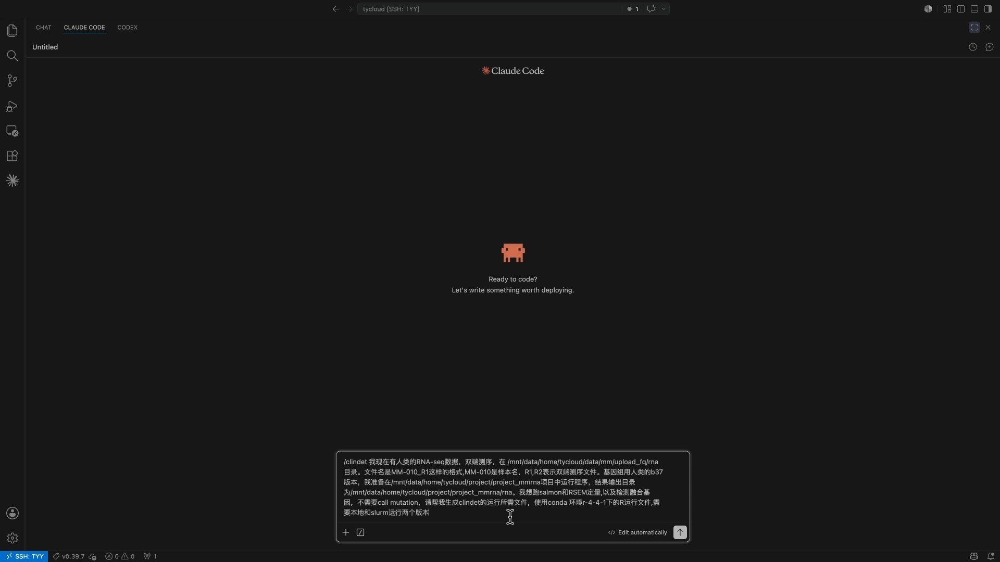

[](https://doi.org/10.5281/zenodo.16892396)
[](https://docs.conda.io/en/latest/)
[](https://www.docker.com/)
[](https://sylabs.io/docs/)
[](https://wakatime.com/badge/user/94f8e465-a61f-47b9-a978-b968e89d900c/project/c6818ba9-2a84-4915-b3b0-3efb385cd2fe)


## Introducción
**ClinDet** (**Clin**ical **Det**ector) es un pipeline de Snakemake para el análisis integral de genomas y transcriptomas del cáncer, integrando múltiples herramientas de vanguardia para generar resultados consensuados. El pipeline admite una amplia gama de configuraciones experimentales, incluyendo:

1. Archivos de entrada FASTQ

2. Secuenciación de genoma completo (WGS), secuenciación de transcriptoma completo (WTS) y secuenciación dirigida/ panel (WXS)

3. Configuraciones de pares tumor/normal y tumor único

4. La mayoría de las versiones de referencia del genoma GRCh37 y GRCh38

5. Especies no humanas (por ejemplo, ratón, lombilla)

## Visión general del pipeline

<p align="center"></p>

## Instalación
Para construir el complejo entorno de análisis de ClinDet, primero debe instalar Conda, Docker y SingularityCE. Luego, siga las instrucciones en el capítulo de [Instalación](https://zyllifeworld.github.io/clindet_docs/Quick/install.html) de la documentación de ClinDet.

## Uso

> [!NOTE]
> Si no está familiarizado con snakemake, consulte [esta página](https://snakemake.readthedocs.io/en/stable/)。

Todo lo que necesita para ejecutar ClinDet es un archivo samplesheet.csv que contenga las rutas a sus archivos fastq de entrada.

```csv
Tumor_R1_file_path,Tumor_R2_file_path,Normal_R1_file_path,Normal_R2_file_path,Sample_name,Target_file_bed,Project
/AbsoPath/of/projects/CGGA_WES/data/T_CGGA_D14_r1.fq.gz,/AbsoPath/of/projects/CGGA_WES/data/T_CGGA_D14_r2.fq.gz,/AbsoPath/of/projects/CGGA_WES/data/B_CGGA_D14_r1.fq.gz,/AbsoPath/of/projects/CGGA_WES/data/B_CGGA_D14_r2.fq.gz,CGGA_D14,/AbsoPath/of/target.bed,CGGA_WES
/AbsoPath/of/projects/CGGA_WES/data/T_CGGA_653_r1.fq.gz,/AbsoPath/of/projects/CGGA_WES/data/T_CGGA_653_r2.fq.gz,/AbsoPath/of/projects/CGGA_WES/data/B_CGGA_653_r1.fq.gz,/AbsoPath/of/projects/CGGA_WES/data/B_CGGA_653_r2.fq.gz,CGGA_653,/AbsoPath/of/target.bed,CGGA_WES
```

Luego, puede iniciar `ClinDet` preparando un archivo *.smk (por ejemplo, snake_wes.smk).
```bash
nohup snakemake -j 30 --printshellcmds -s snake_wes.smk \
--use-singularity --singularity-args "--bind /your/homepath/:/your/homepath/" \
--latency-wait 300 --use-conda >> wes.log
```

Para obtener más detalles y funcionalidad adicional, consulte la documentación principal de [ClinDet](https://zyllifeworld.github.io/clindet_docs/)


## Casos de uso
Para facilitar la adopción por parte de los usuarios, ClinDet incluye una variedad de casos de uso. Estos ejemplos están diseñados para ayudar a los usuarios a familiarizarse con el software y adaptarlo para su análisis específico. Información detallada está disponible en el capítulo de [Caso de uso](https://zyllifeworld.github.io/clindet_docs/usecase/index.html) de la documentación.


1. **Caso de uso I**: Llamado de SNV y CNV a partir de datos de secuenciación de exoma completo
1. **Caso de uso II**: Detección de genes fusionados del RNA-seq de un paciente con mieloma múltiple
2. **Caso de uso III**: Secuenciación de genoma completo de la línea celular COLO829
3. **Caso de uso IV**: Cuantificación de las contribuciones de mutaciones en genes de reparación de ADN a las firmas mutacionales（***C. elegans***） 

## Desarrollo de ClinDet visualizado​

> Haga clic en la imagen de arriba para ver el video demo de desarrollo en Bilibili.

<a href="https://www.bilibili.com/video/BV1eTsUzuEFo" target="_blank" style="display: block; text-align: center;"></a>

## Créditos
El pipeline `ClinDet` fue escrito y es mantenido por Yuliang Zhang ([@Yuliang Zhang](https://github.com/zyllifeworld)) , Junyi Zhang y Jianfeng Li de
el [National Research Center for Translational Medicine at Shanghai](https://github.com/clindet).

Agradecemos a las siguientes organizaciones y personas por su amplia asistencia en el desarrollo de este pipeline,
listados en orden alfabético:
- [Broad Institute](https://www.broadinstitute.org/)
- [German Cancer Research Center](https://www.dkfz.de/en/)
- [Hartwig Medical Foundation Australia](https://www.hartwigmedicalfoundation.nl/en/partnerships/hartwig-medical-foundation-australia/)
- [Wellcome Sanger Institute](https://www.sanger.ac.uk/)
- [New York Genome Center](https://www.nygenome.org/)
- Jianfeng Li


## Citas

Puede citar el registro Zenodo de `ClinDet` para una versión específica utilizando el siguiente DOI:
[10.5281/zenodo.16892396](https://doi.org/10.5281/zenodo.16892396)


> **Análisis de datos sostenible con Snakemake**
>
> Mölder, F., Jablonski, K.P., Letcher, B., Hall, M.B., Tomkins-Tinch, C.H., Sochat, V., Forster, J., Lee, S., Twardziok, S.O., Kanitz, A., Wilm, A., Holtgrewe, M., Rahmann, S., Nahnsen, S., Köster, J.
>
> _F1000Research_ 2021. doi: [10.12688/f1000research.29032.3](https://doi.org/10.12688/f1000research.29032.3).

## Implementación interactiva asistida por LLM (Beta)

ClinDet proporciona una **habilidad de Código Claude** (https://github.com/zyllifeworld/YULUMINA) que genera automáticamente los archivos de configuración del pipeline a partir de descripciones en lenguaje natural. Los usuarios pueden invocar la habilidad en VS Code a través de Código Claude y describir su configuración experimental en lenguaje sencillo, por ejemplo:

> Tengo datos de RNA-seq de extremo emparejado de humanos en `/mnt/data/home/tycloud/data/mm/upload_fq/rna`. Los nombres de los archivos siguen el patrón `MM-010_R1.fq.gz` (muestra `MM-010`, lecturas de extremo emparejado `R1`/`R2`). Genoma de referencia: humano b37. Directorio del proyecto: `/mnt/data/home/tycloud/project/project_mmrna`, salida: `/mnt/data/home/tycloud/project/project_mmrna/rna`. Análisis necesarios: cuantificación de Salmon, cuantificación de RSEM y detección de genes fusionados (sin llamado de mutaciones). Usar entorno conda `r-4-4-1` para ejecutar scripts en R. Generar ambos guiones de ejecución local y Slurm.
>
> 我现在有人类的RNA-seq数据，双端测序，在 /mnt/data/home/tycloud/data/mm/upload_fq/rna目录。文件名是MM-010_R1这样的格式,MM-010是样本名，R1,R2表示双端测序文件。基因组用人类的b37版本，我准备在/mnt/data/home/tycloud/project/project_mmrna项目中运行程序，结果输出目录为/mnt/data/home/tycloud/project/project_mmrna/rna。我想跑salmon和RSEM定量,以及检测融合基因，不需要call mutation，请帮我生成clindet的运行所需文件，使用conda 环境r-4-4-1下的R运行文件,需要本地和slurm运行两个版本

El LLM luego produce todos los archivos necesarios para ejecutar ClinDet — `project_config.yaml`, `sample_sheet.csv`, comandos de ejecución local y comandos de Snakemake listos para clúster — automatizando así la configuración de flujos de trabajo de análisis de datos ómicos.


<a href="https://www.bilibili.com/video/BV1S2LN6gE86" target="_blank" style="display: block; text-align: center;"></a>


## Trabajo futuro
1. Informe de comparación de uso de recursos
    1. Ampliar las salidas de comparación actuales basadas en texto a informes visuales que resuman el tiempo de ejecución, uso de memoria, utilización de CPU y otras métricas de consumo de recursos.
2. Servidor MCP de ClinDet
    1. Descarga y configuración automática de archivos de configuración genómica específicos de especies, curados y mantenidos por expertos en bioinformática de dominio de diferentes comunidades de investigación.
    2. Módulos avanzados de análisis de biología del tumor basados en las salidas estandarizadas de ClinDet, incluyendo análisis de evolución clonal, identificación de genes conductores, detección de integración viral, análisis de elementos transponibles, construcción de bases de conocimiento específicas de enfermedades y otras aplicaciones posteriores.
    3. ...
3. ...
